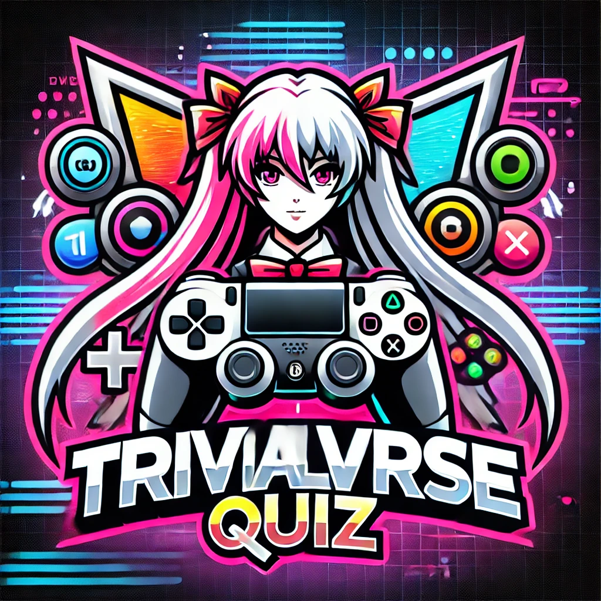

# TrivialVerseQuiz

## Token

- Para que el bot fucione hemos utilizado el BotFather para que nos genere un Token, el token en el codigo ira algo asi:

TOKEN = '7455775782:AAGAnwCVb1yitZY-dXUMflFQPeOSY4WEyyc' 
bot = telebot.TeleBot(TOKEN) 

## Funcionalidades y Comandos Principales

1. **/start**

Inicia el bot, da la bienvenida al usuario y le invita a seleccionar una categoría para comenzar.

2. **/help**

Muestra la lista de comandos disponibles y su funcionalidad.

3. **/stop**

Detiene la partida actual.

4. **/top**

Muestra el ranking de jugadores (aún en desarrollo).

6. **/time**

 Activa el modo de juego con tiempo.

5. **/dlc**

Indica que el contenido adicional (DLC) está en desarrollo.

## Finalizar Bot

- Para finalizar el bot hemos utilitzado tenemos que precionar Ctrl + C, ja que sino el bot entra en un bucle infinito a la espera de una respuesta del usuari